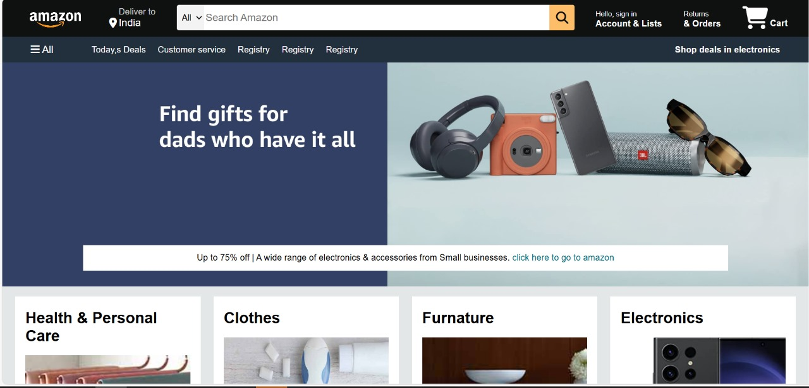

# 🛒 Amazon Clone

## 🌟 Overview
The **Amazon Clone** is a simple yet responsive web page designed using **HTML & CSS**. It replicates Amazon’s homepage layout with a structured navigation bar, search bar, shopping categories, and footer section.

## 🚀 Features
✔️ **Fully Responsive Design** 📱
✔️ **Navigation Bar with Search Functionality** 🔍
✔️ **Product Sections with Images & Links** 🛍️
✔️ **Hover Effects for a Smooth UI Experience** 🎨
✔️ **Custom FontAwesome Icons Integration** 🔧
✔️ **Structured Footer with Multiple Links** 📌

## 🛠️ Technologies Used
- **HTML5** – Structure of the page
- **CSS3** – Styling and layout design
- **FontAwesome** – Icons for navigation and UI enhancements

## 📸 Preview


## 📂 Project Structure
```
/amazon-clone
│── index.html      # Main HTML file
│── amazon.css      # CSS Styling file
│── images/         # Folder containing all image assets
│── README.md       # Project documentation
```

## 🔧 How to Use
1. Clone the repository:
   ```sh
   git clone https://github.com/rikream/Amazon-Clone.git
   ```
2. Open `index.html` in any web browser.

## 🤝 Contributing
Contributions are welcome! Fork the repository, make your changes, and open a **Pull Request**. 😊

## 📜 License
This project is open-source and available under the **MIT License**.

---
🌟 **Enjoy coding this Amazon Clone!** 💻

